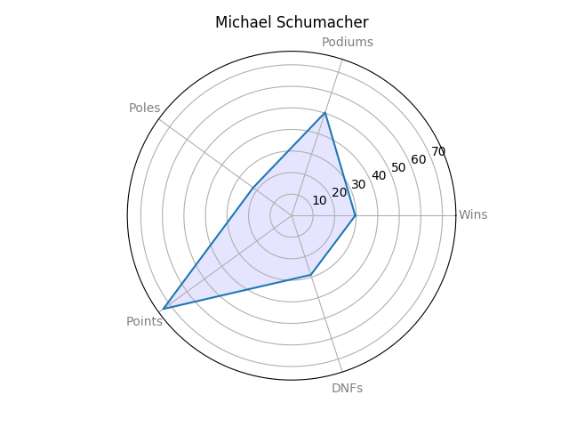
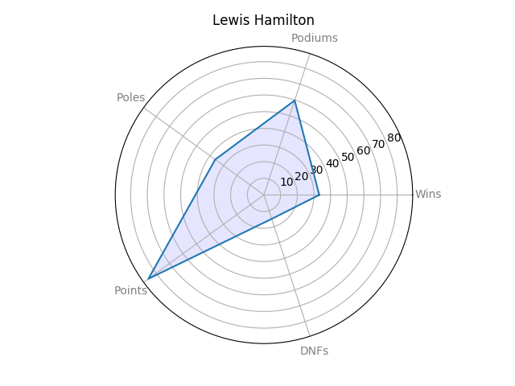
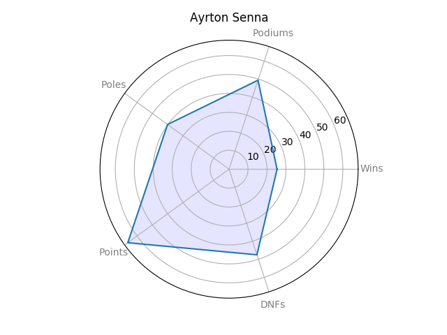
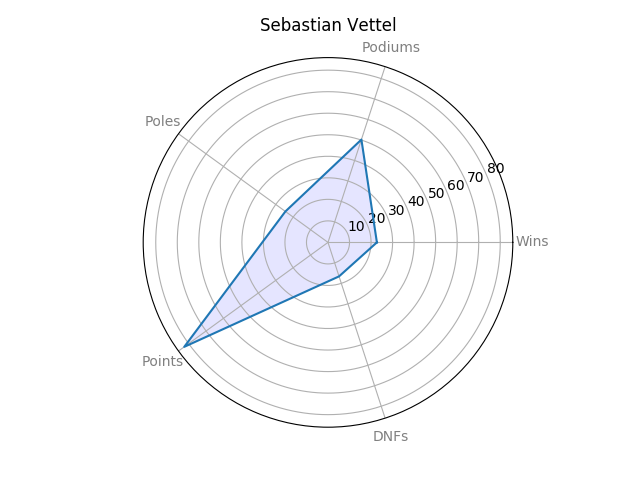
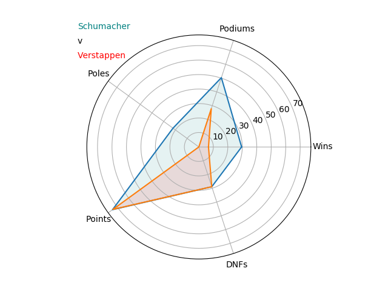
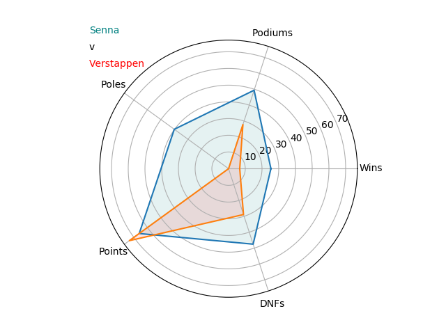
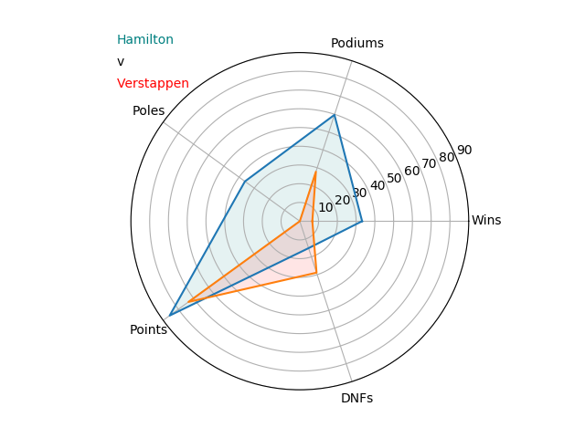
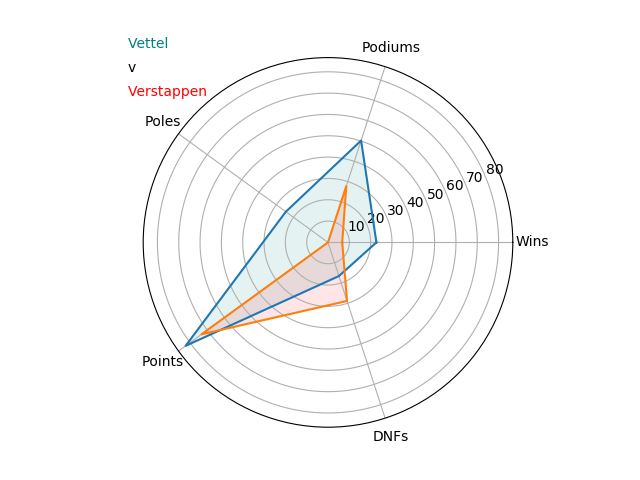

# F1 Big Data Analysis
F1 Big Data Analysis consists of data since 1950 upto present.

The dataset has been collected and is maintained by <a href="https://ergast.com/mrd/">ERGAST</a>.

The dataset is fully updated to the last Austrian Grand Prix, 2019.

# How DNF Trends have Evolved over a Period of 69 Years

Logically speaking, DNFs are expected to decrease as the human understanding of machines and technology advances while the number of classified finsihes are expected to increase. 

While the latter is true, DNFs have not necessarily decreased for the different issues. 
As the plot speaks for it itself, DNFs due to mechanical issues like Engine, Gearbox have not made any improvements. 

There has also been a sharp increase in the number of DNFs due to car failure following a collision on track during 1980-2010 as opposed to the previous years.

But in recent years (2010-present), overall classified finishes have made drastic improvement with a decrease in the number of DNFs.

  

While in the early years of F1, retirements due to engine failures were dominant, now majority of retirements in races stem from car failures due to on track collisions during the race.

Also, if you were a driver during the period 1950-2010 you were more likely to not finish the race than completing the race. 

***
# Is Max Verstappen on the road to becoming the Greatest Ever?

**Michael Schumacher** is one of the greatest drivers in F1 without a doubt (possibly is the greatest).
But other drivers like **Lewis Hamilton**, **Ayrton Senna**, **Sebastian Vettel** have similar looking stats as well.

  

But the question here though, where does a 21 year old **Max Verstappen** lie amongst some of the greatest names in the sport?

To no surprise, he has 0 poles and a terrible wins to races ratio compared to **Schumacher** and **Senna** as he still drives an uncompetitive car at RedBull.
Interestingly enough though **Verstappen** somehow has a better points finishes to races than **Ayrton Senna** while matching **Schumacher**'s stat.

Against current drivers like **Hamilton** and **Vettel**, they have the better stats.

However, not to forget **Verstappen** is only *21 years old* and the youngest Grand Prix winner ever. He also has the most podium finishes aged 21 or below with an incredible 25 times, the nearest competitor being **Charles Leclerc** who is also 21 with a mere 4 times, followed by **Vettel** and **Alonso** with 3 finishes each.

So, the short answer?

**_Yes. Definitely yes._**

He started his F1 career really strong and still has a lot of years into his career. It would be really interesting to see how he develops over the years and given a competitive car, we may even witness the _Youngest F1 World Champion_ ever. 
