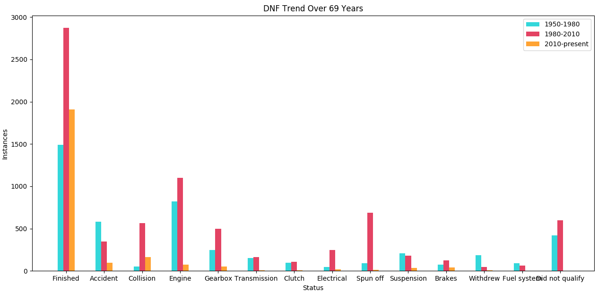
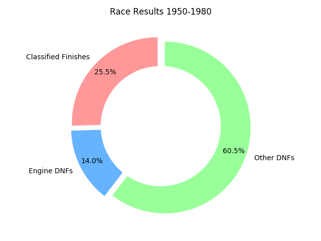
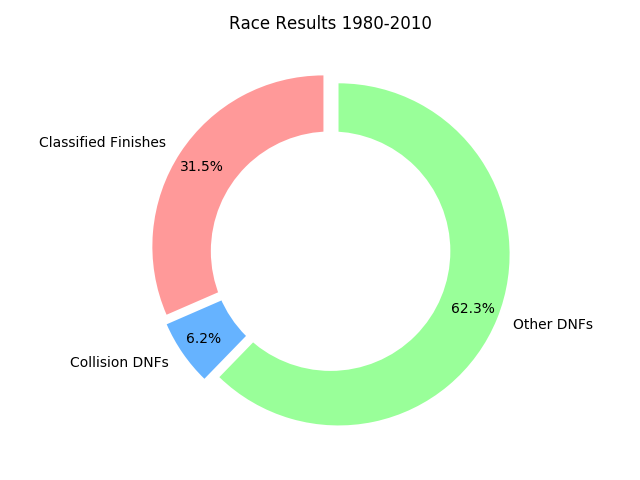
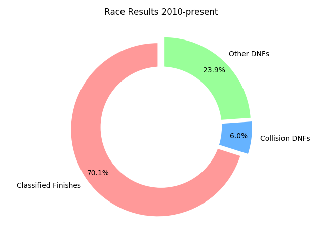

# F1 Big Data Analysis
F1 Big Data Analysis consists of data since 1950 upto present.

The dataset has been collected and is maintained by <a href="https://ergast.com/mrd/">ERGAST</a>.

The dataset is fully updated to the last Austrian Grand Prix, 2019.

# How DNF Trends have Evolved over a Period of 69 Years

Logically speaking, DNFs are expected to decrease as the human understanding of machines and technology advances while the number of classified finsihes are expected to increase. 

While the latter is true, DNFs have not necessarily decreased for the different issues. 
As the plot speaks for it itself, DNFs due to mechanical issues like Engine, Gearbox have not made any improvements. 

There has also been a sharp increase in the number of DNFs due to car failure following a collision on track during 1980-2010 as opposed to the previous years.

But in recent years (2010-present), overall classified finishes have made drastic improvement with a decrease in the number of DNFs.

  

While in the early years of F1, retirements due to engine failures were dominant, now majority of retirements in races stem from car failures due to on track collisions during the race.
